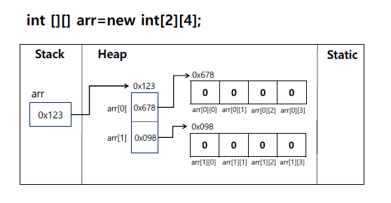

# 2차원 배열

### 2️⃣2차원 배열
- 자료형이 같은 1차원 배열의 묶음으로 배열 안에 다른 배열 존재
- 2차원 배열은 할당된 공간마다 인덱스 번호 두 개 부여
앞 번호는 행, 뒷 번호는 열 [0][0]

<br>

### 2️⃣2차원 배열 선언

> 📢 자료형[][] 배열명; <br>
자료형 배열명[][]; <br>
자료형[] 배열명[];

<br>

### 2️⃣2차원 배열 할당

> 📢 자료형[][] 배열명 = new 자료형[행크기][열크기]; <br>
자료형 배열명[][] = new 자료형[행크기][열크기]; <br>
자료형[] 배열명[] = new 자료형[행크기][열크기]; <br>
> - ex) int[][] arr = new int[3][4];



<br>

### 2️⃣2차원 배열 초기화

- 인덱스를 이용한 초기화

```java
arr[0][0] = 1;
arr[1][1] = 2;
```

- for문을 이용한 초기화

```java
for(int i = 0; i < arr.length; i++) {
          for(int j = 0; j < arr[i].length; j++) {
                    arr[i][j] = j;
          }
}
```

- 선언과 동시에 초기화

```java
int[][] arr = {{1, 2, 3, 4}, {5, 6, 7, 8}};
int[][] arr = new int[][]{{1, 2, 3, 4}, {5, 6, 7, 8}};
String fruit[][] = {{"사과", "딸기", "석류"}, {"바나나", "참외", "레몬"}};
```