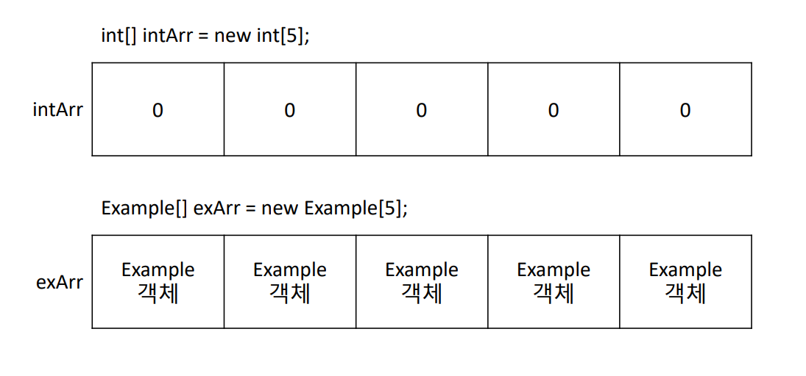
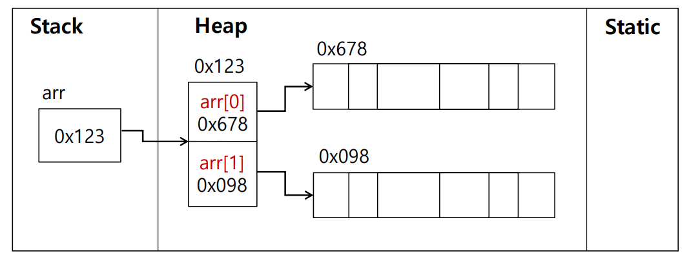

# 객체배열

- 객체를 저장하는 배열로 배열의 자료형을 클래스명(사용자 정의 자료형)으로 지정하여 활용



### 👯‍♀️객체배열 선언과 할당

- 선언

> 📢 클래스명[] 배열명; <br>
클래스명 배열명[ ] <br>
> - ex) Academy[] arr; <br>
      Academy arr[];

- 할당

> 📢 배열명 = new 클래스명[배열크기] ;
> - ex) arr = new Academy[5];

- 선언과 동시에 할당

> 📢 클래스명 배열명= new 클래스명[배열크기];
> - ex) Academy[] arr = new Academy[5];

<br>

### 👯‍♀️객체배열 초기화

- 인덱스를 이용한 초기화

> 📢 배열명[i] = new 클래스명();
> - ex) arr[0] = new Academy(1, “OO아카데미”);

- 선언과 동시에 할당 및 초기화

> 📢 클래스명 배열명[] = {new 클래스명(), new 클래스명()};
> - ex) Academy arr[] = { 
                             new Academy(1, “OO아카데미”),
                             new Academy(2, “OOO아카데미”)};

<br>

### 👯‍♀️객체배열

```java
Example arr[] = new Example[2];
arr[0] = new Example();
arr[1] = new Example();
```



- arr[index]가 하나의 참조형 변수라고 생각