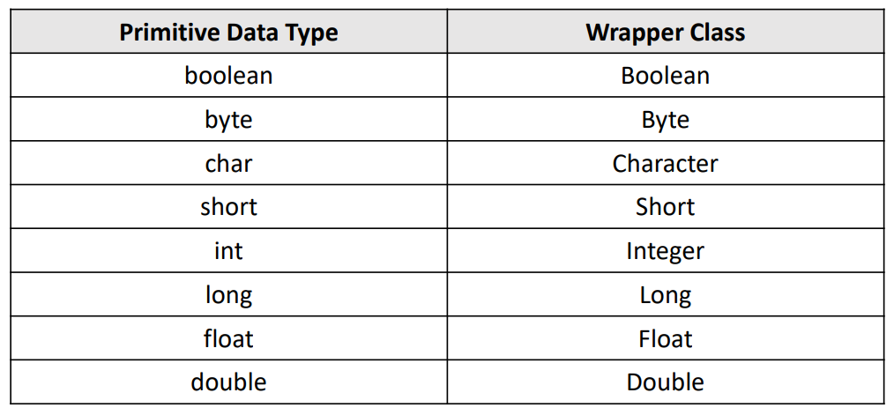
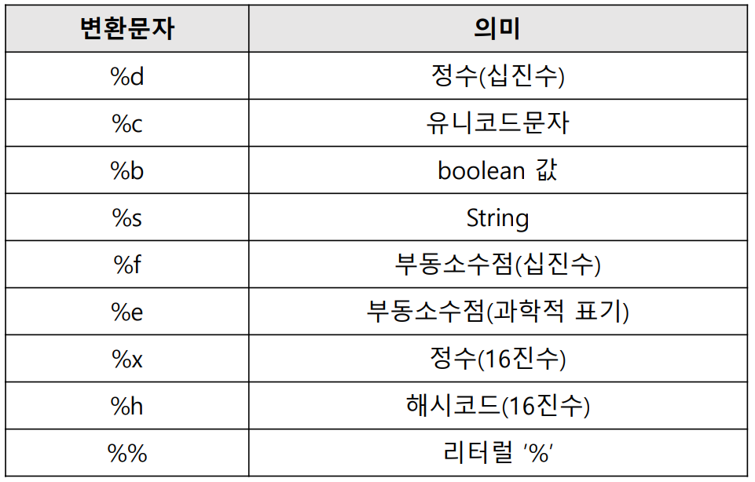

# 기본API

### 🍀String 관련 클래스

- **String 클래스**
    - 문자열 값 수정 불가능, **불변**
    - 수정 시 수정된 문자열이 **새로 할당 되어 새 주소**를 넘김
- **StringBuffer 클래스**
    - 문자열 값 수정 가능, **가변**
    - 수정, 삭제 등이 **기존 문자열에 수정**되어 적용
    - 기본 16문자 크기로 지정된 버퍼를 이용하며 크기 증가 가능
    - 쓰레드 safe 기능 제공(성능 저하 요인)
- **StringBuilder 클래스**
    - **StringBuffer와 동일**하나 쓰레드 safe기능을 제공하지 않음
- **StringTokenizer 클래스**
    - String클래스에서 제공하는 **split()메소드와 같은 기능**을 하는 클래스로 생성 시 **전달받은 문자열을 구분자로 나누어 각 토큰에 저장**

<br>

### 🍀String 클래스가 제공하는 유용한 메소드

- **String.concat(”문자열값”)**
    
    : 두 개의 문자열을 합쳐주는 메소드
    
- **String.contains(”문자열”)** → 반환형 boolean
    
    : 문자열에 매개변수로 전달된 문자열이 포함되어 있는지 확인해주는 기능
    
- **int indexOf(”문자열”)** → 반환형 int
    
    : 문자열에 매개변수로 전달된 문자가 있는지 확인하고 그 자리수(인덱스번호)를 반환해줌
    
    - lastIndexOf(”문자열”)
        
        : 뒤에서부터 검색, 인덱스번호는 변하지 않음
        
- **String[] split(String)**
    
    : 특정구분자(기호)로 구분할 수 있는 문자열을 구분해서 배열로 만드는 것
    
- **String replace(”찾을 값”, “대체할 값”)**
    
    : 특정문구를 대체문구로 교체하는 것

<br>

### 🍀Wrapper 클래스

- Primitive Data Type을 **객체화** 해주는 클래스

    

- **String을 기본 자료형**으로 바꾸기

    ```java
    byte b = Byte.parseByte("1");
    short s = Short.parseShort("2");
    int i = Integer.parseInt("3");
    long l = Long.parseLong("4");
    float f = Float.parseFloat("0.1");
    double d = Double.parseDouble("0.2");
    boolean bool = Boolean.parseBoolean("true");

    char c = "abc".charAt(0)
    ```

<br>

### 🍀날짜 관련 클래스

- **Date 클래스**
    - 시스템으로부터 현재 날짜, 시간 정보를 가져와 다룰 수 있게 만들어진 클래스
    - 생성자 2개만 사용가능, 나머지는 모두 deprecated
    - Calendar 클래스 혹은 GregorianCalendar 클래스 사용 권장
    
        ```java
        Date today = new Date();
        // 시스템으로부터 현재 날짜, 시간 정보를 가져와 기본 값으로 사용
        Date when = new Date(123456798L);
        // long형 정수 값을 가지고 날짜 시간 계산
        // 1970년 1월 1일 0시 0분 0초를 기준으로
        ```
    
- **Calendar 클래스**
    - Calendar 클래스는 생성자가 protected이기 때문에 new 연산자를 통해 객체 생성 불가능
    - **getInstance() 메소드를 통해 객체 생성**
    
- **GregorianCalendar 클래스**
    - GregorianCalendar 클래스는 **Calendar 클래스의 후손 클래스**
    - 년, 월, 일, 시, 분, 초 정보를 필드를 이용하여 다룰 수 있음
    
        ```java
        Calendar today = Calendar.getInstance(); 
        // 생성자가 protected이므로 new 사용 불가
        GregorianCalendar today = new GregorianCalendar(); 
        // Calendar클래스의 후손(파생)클래스
        // 년, 월, 일, 시, 분, 초 정보를 필드(멤버변수)를 이용하여 각각 다룰 수 있음
        int year = today.get(Calendar.YEAR);
        int month = today.get(Calendar.MONTH) + 1;
        int date = today.get(Calendar.DATE);
        int ampm = today.get(Calendar.AM_PM);
        int hour = today.get(Calendar.HOUR);
        int min = today.get(Calendar.MINUTE);
        int sec = today.get(Calendar.SECOND);
        String sAmPm = (ampm == Calendar.AM) ? "오전" : "오후";
        System.out.printf("%d년 %d월 %d일 %s %d시 %d분 %d초",
        year,month,date,sAmPm,hour,min,sec);
        ```

<br>

### 🍀Format 관련 클래스

- **SimpleDateFormat 클래스**
    - Date의 날짜, 시간 정보를 원하는 format으로 출력하는 기능 제공
    - java.text 패키지에 속해있음
    
        ```java
        Date today = new Date();
        SimpleDateFormat ft = new SimpleDateFormat("yyyy-MM-dd");
        String ftToday = ft.format(today);
        //today에 포맷을 적용한 결과를 문자열로 리턴
        ```
    
- **Formatter 클래스**
    - 값 출력 시 format 적용하여 출력
    - Formatter 객체 생성 시 변환된 결과를 보낼 곳의 정보를 생성자 인자로 전달
    
        ```java
        Formatter f = new Formatter(System.out);
        f.format("%s, %d, %d \n", "String", 10, 20);
        //System.out.printf("%s, %d, %d \n", "String", 10, 20);도 가능
        ```
    
- **Format 변환 문자**
    
    
    
- **escape 문자**
    
    