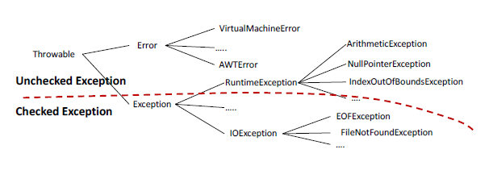

# 예외처리(Exception)

### 🤯프로그램 오류

- 프로그램 수행 시 치명적 상황이 발생하여 비정상 종료상황이 발생한 것
- 프로그램 에러라고도 함

 

### 🤯오류의 종류

- 컴파일 에러 : 프로그램 실행을 막는 소수 상 문법 에러 → 소스 구문을 수정하여 해결
- 런타임 에러 : 프로그램 실행 후 에러
- 시스템 에러 : 컴퓨터 오작동(개발자 해결 불가)

 

### 🤯오류 해결 방법

- 소수 수정으로 해결 가능한 에러 : 예외(Exception)
- 예외 상황(예측 가능한 에러)구문을 처리하는 방법인 예외처리를 통해 해결

 

### 🤯예외 클래스 계층 구조

- 모든 예외의 최고 조상은 Exception
- 반드시 예외 처리해야 하는 Checked Exception, 해주지 않아도 되는 Unchecked Exception

    

- RuntimeException 클래스
    - Unchecked Exception으로 주로 프로그래머의 부주의로 인한 오류인 경우가 많기 때문에 예외 처리보다 코드를 수정해야 하는 경우가 많음
    - 후손 클래스
        - ArithmeticException(0으로 나누는 경우 발생, if문으로 나누는 수가 0인지 검사)
        - ArrayIndexOutOfBoundsException(배열의 index범위를 넘어서 참조하는 경우, 배열명.length를 사용하여 배열의 범위 확인)
        - NegativeArraySizeException(배열 크기를 음수로 지정한 경우 발생)
        - NullPointerException(Null인 참조변수로 객체 멤버 참조 시도 시 발생)
        - ClassCastException(Cast연산자 사용 시 타입 오류, instanceof연산자로 객체타입 확인 후 cast연산)

 

### 🤯예외처리 방법

- Exception 처리를 호출한 메소드에게 위임
    - 메소드 선언시 throws ExceptionName 문을 추가
    - 호출한 상위 메소드에게 처리 위임/ 계속 위임하면 main()메소드까지 위임
    - 거기서도 처리되지 않는 경우 비정상 종료
- Exception이 발생한 곳에서 직접 처리
    - try ~ catch문을 이용하여 예외처리
    - try : exception이 발생할 가능성이 있는 코드 작성
    - catch : try구문에서 exception 발생 시 해당하는 exception에 대한 처리 작성
               여러 개의 exception 처리가 가능하나 상속 관계 고려해야 함
    - finally : exception 발생 여부와 관계없이 꼭 처리해야 하는 로직 작성
        - 중간에 return문을 만나도 finally구문은 실행