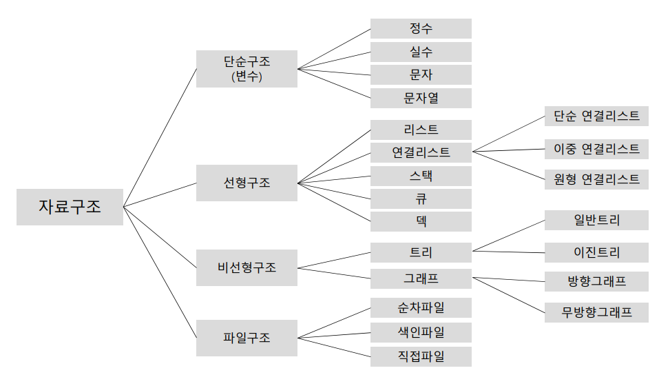
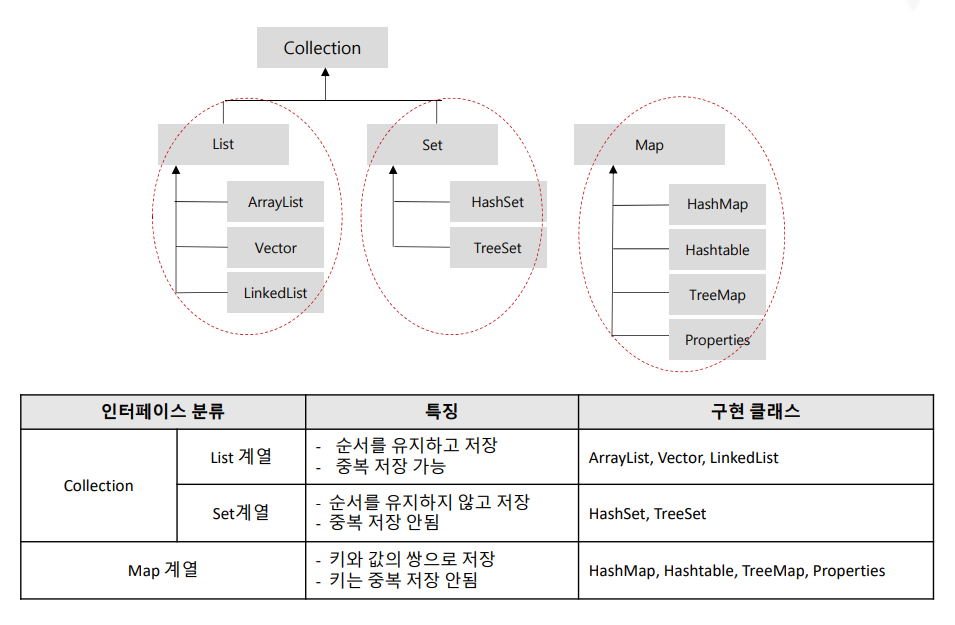
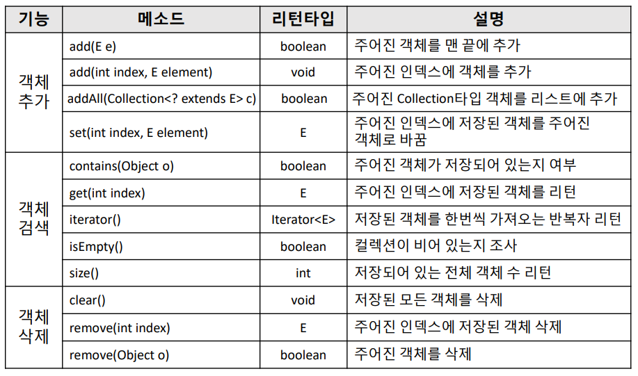
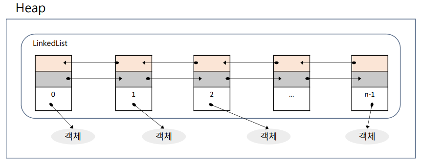
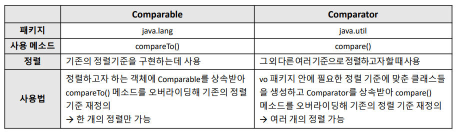
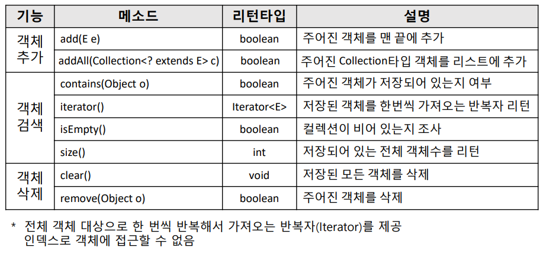
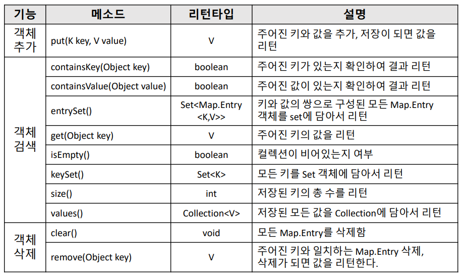

# 컬렉션프레임워크

### 🍱컬렉션(Collection)

- 컬렉션은 자바에서 제공하는 자료구조를 담당하는 프레임워크
    
    > 📢 자료구조 : 메모리상에서 자료를 구조적으로 처리하는 방법
    
- 추가, 삭제, 정렬 등의 기능처리가 간단하게 해결되어 자료구조적 알고리즘을 구현할 필요 없음
- java.util 패키지에 포함
- 인터페이스를 통해 정형화된 방법으로 다양한 컬렉션 클래스 이용가능

<br>

### 🍱자료구조



<br>

### 🍱배열의 문제점 & 컬렉션의 장점

- 배열의 문제점
    - 한 번 크기를 지정하면 변경할 수 없다.
        - 필요에 따라 공간을 늘리거나 줄일 수 없음
        - 공간 크기 부족할 시 에러 발생
        - 할당 시 넉넉한 크기로 할당(메모리 낭비)
    - 기록된 데이터에 대한 중간 위치의 추가, 삭제가 불편하다.
        - 추가, 삭제할 데이터부터 마지막 기록된 데이터까지 하나씩 뒤로 밀어내고 추가해야함(복잡한 알고리즘)
    - 한 타입의 데이터만 저장 가능하다.
- 컬렉션의 장점
    - 저장하는 크기의 제약이 없다.
    - 추가, 삭제, 정렬 등의 기능 처리가 간단하게 해결된다.
        - 자료를 구조적으로 처리하는 자료구조가 내장되어 있어 알고리즘 구현이 필요 없음
    - 여러 타입의 데이터가 저장 가능하다.
        - **객체만 저장**할 수 있기 때문에 필요에 따라 기본 자료형을 저장해야 하는 경우 Wrapper클래스 사용

<br>

### 🍱컬렉션의 주요 인터페이스



- List = 선형구조(차곡차곡 순서대로 저장), 중복값 저장 가능
- Set = 순서없음(ex. 바구니에 담는 느낌), 안을 볼 수 없음(=원하는 객체 뽑아 올 수 없음)
         → 전체 다 뽑아와서 확인해야 함, 중복값 저장 불가능
- Map = 키밸류 형식(key : value) key = 변수명, value = 값
    - 바구니에 데이터(value)까진 Set형식과 유사하지만 데이터(value)에 이름(key)를 달아준다.
    - 이름으로 값을 가져올 수 있음.(Set과의 차이점)
    - key를 기준으로 값을 가져오기 때문에 key값은 중복불가, value값은 중복가능

> 📢 연산자 사용x, 모두 메소드로!

<br>

### 🍱List

<details>
<summary>List</summary>

- 자료들을 순차적으로 나열한 자료구조
- 인덱스로 관리되며, 중복해서 객체 저장 가능
- 구현 클래스 → ArrayList, Vector, LinkedList
- **List는 인터페이스**이므로 자료형으로는 사용 가능하지만, 생성 불가

#### 🍱List 계열 주요 메소드



<details>
<summary>🍱ArrayList</summary>

- List의 후손으로 초기 저장용량은 10으로 자동 설정(따로 지정 가능)
- 저장 용량을 초과한 객체들이 들어오면 자동으로 증가(고정도 가능)
- 동기화(Synchronized)를 제공하지 않음
    - 동기화 : 하나의 자원(데이터)에 대해 여러 스레드가 접근하려 할 때 한 시점에서 하나의 스레드만 사용할 수 있도록 하는 것
    ```java
    ArrayList list = new ArrayList(); //배열 할당과 비슷
    ```

<br>

#### 🍱생성된 list 저장소에 데이터 저장하기

> 📢 add(저장할 데이터);
```java
list.add(true); //자동으로 0번 인덱스에 저장
list.add(19); //자동으로 1번 인덱스에 저장
list.add("유병승")
```

- ArrayList객체에 저장 가능한 데이터는 자바에서 사용하는 모든 데이터!

<br>

#### 🍱저장된 데이터 가져오기(호출하기)

> 📢 get(index번호);

```java
System.out.println(list.get(0));
```

- 기본적으로 ArrayList에 저장되는 데이터는 Object자료형으로 저장이 된다.
- 대입된 실제 데이터를 사용하려면 형변환 필요

<br>

#### 🍱List 자료형의 길이

> 📢 size();

- 전체 데이터에 접근(순회)할 때는 반복문을 사용하면 편리(뒤에 다른 메소드 나옴)
- length는 없음!

```java
for(int i = 0; i < list.size(); i++) {
	System.out.println(list.get(i));
}
```

```java
ArrayList foods = new ArrayList(); //Food 클래스 생성되어 있음

foods.add(new Food("돈까스", 10000, "일식", new Date())); //객체 데이터 저장
foods.add(new Food("초밥", 2000, "일식", new Date()));

Food f = (Food)foods.get(1); //Object를 반환하기 때문에 Food로 형변환 필요
System.out.println(f.getName() + " " + f.getPrice());
```
</details>

<br>

<details>
<summary>🍱LinkedList</summary>

- List의 후손으로 인접 참조를 링크해 체인처럼 관리
- 특정 인덱스에서 객체를 제거하거나 추가하게 되면 바로 앞/뒤 링크만 변경하면 되기 때문에 객체 삭제와 삽입이 자주 일어나는 곳에서는 ArrayList보다 성능이 좋음
- 사용법은 ArrayList 클래스와 유사
    
    
    
    ```java
    LinkedList linkList = new LinkedList();
    linkList.add("이동제");
    linkList.add("최인호");
    System.out.println(linkList.get(0));
    linkList.forEach((e)->System.out.println(e));
    ```
    
    ### 값의 첫 번째 값과 마지막 값 출력하기
    
    ```java
    System.out.println(linkList.getFirst()); 
    System.out.println(linkList.getLast());
    ```
</details>

#### 🍱Comparable, Comparator


</details>

<br>

### 🍱Set

<details>
<summary>Set</summary>

- 저장 순서가 유지되지 않고 중복 객체도 저장하지 못하게 하는 자료구조
- null도 중복을 허용하지 않기 때문에 1개의 null만 저장
- 구현 클래스 → HashSet, LinkedHashSet, TreeSet

#### 🍱Set 계열 주요 메소드



#### 🍱HashSet

- Set에 객체를 저장할 때 hash함수를 사용하여 처리속도가 빠름
- 동일 객체뿐만 아니라 동등 객체도 중복하여 저장하지 않음

<br>

#### 🍱LinkedHashSet

- HashSet과 거의 동일하지만 Set에 추가되는 순서를 유지한다는 점이 다름
</details>

<br>

### 🍱Enumeration, Iterator, Listlterator

<details>
<summary>Enumeration, Iterator, Listlterator</summary>

- 컬렉션에 저장된 요소를 접근하는데 사용되는 인터페이스
- Enumeration → Iterator의 구버전
- Listlterator → Iterator를 상속받아 양방향 특징
</details>

<br>

### 🍱Map

<details>
<summary>Map</summary>

#### 🍱Map 계열 주요 메소드


</details>