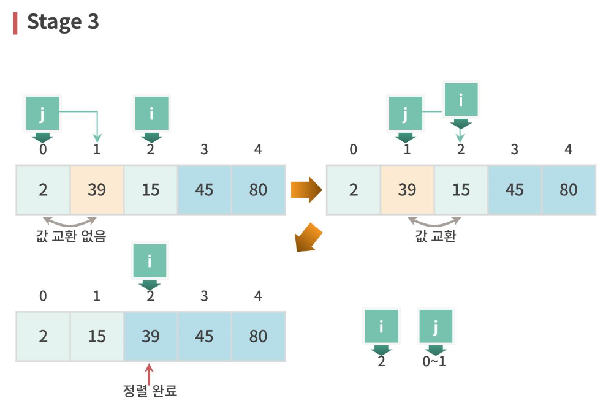
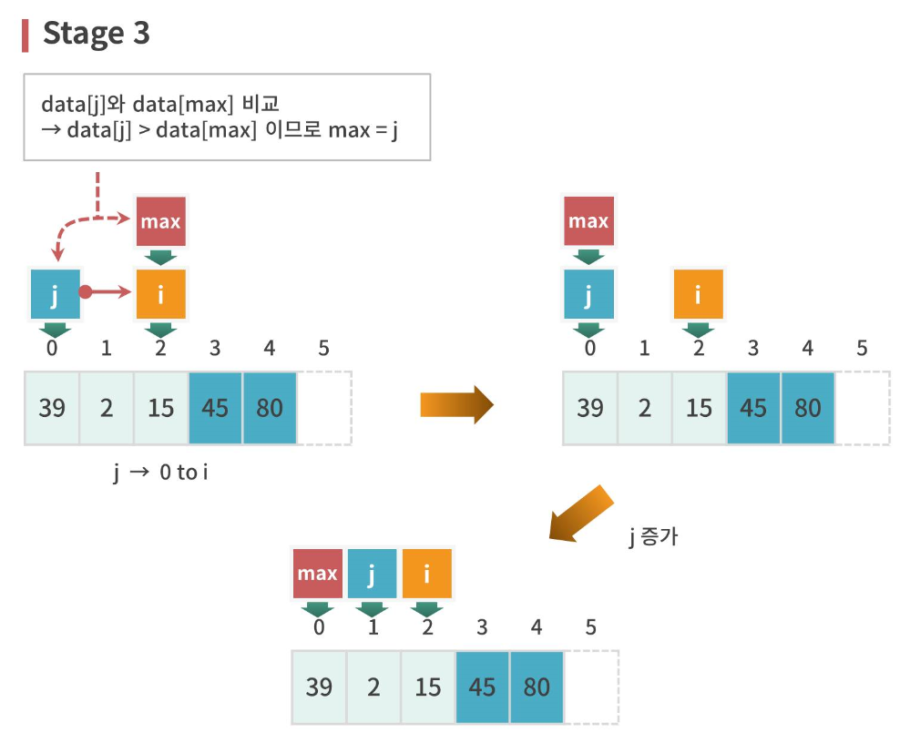

# 알고리즘(학은제)

> ### [목차]
> 1. [1-1 알고리즘 정의와 다양한 알고리즘 문제](#1-1-알고리즘-정의와-다양한-알고리즘-문제)
> 2. [1-2 알고리즘의 특징 및 알고리즘 복잡도 표기법](#1-2-알고리즘의-특징-및-알고리즘-복잡도-표기법)
> 3. [2-1 버블정렬과 선택정렬 알고리즘](#2-1-버블정렬과-선택정렬-알고리즘)
> 4. [2-2 삽입 정렬 알고리즘](#2-2-삽입-정렬-알고리즘)
> 5. [3-1 병합 정렬 알고리즘](#3-1-병합-정렬-알고리즘)

<br>

## 1-1 알고리즘 정의와 다양한 알고리즘 문제

### 🔍알고리즘 정의

문제를 해결하기 위한 단계적인 절차를 의미
- 효율적인 알고리즘 고안이 중요
- 여러 종류의 알고리즘이 있을 수 있으나, 항상 보다 효율적인 알고리즘을 고안하는 것이 매우 중요

<br>

### 🔍다양한 문제와 알고리즘

#### 1. 임의의 숫자 찾기
- 순차 탐색(Sequential Search) 
    - 원하는 숫자가 나올 때까지 하나하나 탐색<br>
-> 처음에 있으면 빠르지만, 마지막에 있으면 그만큼 느려짐

- 이진 탐색(Binary Search)
    - 순차 탐색보다 효율적으로 찾을 수 있음
    - 숫자를 오름차순으로 정렬 후 가운데 숫자를 내가 찾는 숫자와 비교
    - 내가 찾으려는 숫자 범위에 없는 절반의 숫자는 확인 필요없음

    > 1. 오름차순으로 데이터를 정렬
    > 2. 중간 숫자와 K 비교한 후 같으면 탐색 성공
    > 3. K가 작으면 앞부분 반에서 같은 방법으로 K를 찾음
    > 4. K가 크면 뒷부분 반에서 같은 방법으로 K를 찾음

<br>

#### 2. 동전 거스름돈
물건을 사고 거스름돈을 동전으로 받아야 한다면?
- 대부분 가장 적은 수의 동전을 원함

<br>

> 가장 큰 액면의 동전부터 차례로 찾기
> - 남은 거스름돈 액수를 넘지 않는 한도에서 가장 큰 액면의 동전을 계속하여 선택<br>
> -> 그리디(Greedy) 알고리즘 : 현재 최선의 방법을 먼저 사용

<br>

#### 3. 한붓 그리기
현재 점으로 돌아오는 사이클이 있으면 진행
- 단, 외길이면 즉, 인접한 점이 하나밖에 없으면 사이클 체크 없이 인접한 점으로 진행

<br>

#### 4. 미로 찾기
그리스 신화에서 아테네의 한 젊은 청년 테세우스는 칼과 실타래를 가지고 실을 풀면서 미로에 들어감
미노타우르를 칼로 죽이고, 실을 다시 감으면서 미로를 빠져나옴

> 실제 미로 찾기
> - 대부분의 경우 실타래가 없음
> - 이러한 상황에서 어떻게 미로를 빠져나올 수 있을까?

> 일반적인 방법
> 1. 현 위치에서 한 방향을 선택하여 이동
> 2. 길이 막혀 있으면 다시 되돌아 나옴
> 3. 다른 방향으로 다시 시도
> 4. 가능하다면 지나갔던 곳을 표시해 놓고 다시 안감

> 오른손 법칙
> 1. 현 위치에서 한 방향을 선택하고, 오른손을 벽에 댄다.
> 2. 출구가 나올 때까지 계속 오른손을 벽에서 떼지 않고 계속 걸어간다.

<br>

#### 5. 가짜 동전 찾기
아주 많은 동전 속에 1개의 가짜 동전이 있음
- 가짜 동전은 눈으로 식별 불가능
- 가짜 동전의 무게는 정상적인 동전보다 약간 가벼움

<br>

> 1. 동전 1개를 저울 왼편에 올리고, 나머지 동전을 하나씩 오른편에 올려서 가짜를 찾기<br>
> **1~(n-1)회**
> - 운이 좋으면 1번 만에 가짜 동전을 찾음
> - 최악은 가장 마지막에 가짜 동전을 올려놓게 되는 경우

> 2. 동전을 2개씩 짝을 지어, n/2 짝을 각각 저울에 달아서 가짜 동전을 찾아보자<br>
> **1~n/2회**
> - 최악의 경우 저울 사용 횟수가 거의 1/2로 감소

> 3. 동전 더미를 반으로 나누어 저울 양편에 놓아보자<br>
> **log2 n번** 
> - 남은 동전 수는 계속 1/2로 줄어들고, 나중에 2개가 남았을 때 가짜 동전을 가려냄

<br>

#### 6. 독이 든 술단지
많은 술단지 중 하나에 독이 들어있음. 눈으로 확인할 수 없고, 아주 조금만 맛보아도 정확이 일주일 후에 죽음

> 술단지가 2개일 때
> - 한 명의 신하가 1개의 술단지의 술을 맛 봄
> - 일주일 후 살아있다면 맛보지 않은 단지에 독이 있고, 아니라면 맛본 술단지에 독이 있음

> 술단지가 4개일 때
> - 세 사람이 각각 한 개씩 맛본다면..
> - 두 사람으로 줄일 수 없을까?<br>
>   - 문제점 : 맛보지 않은 2개의 단지 중 하나에 독이 들어있으면 어느 하나에 독이 들어 있는지를 알 수 없음

> 아이디어
> - 4개의 단지 중에서 두개의 술단지는 각각 마심
> - 나머지 두개의 단지 중에 하나를 두 신하에게 동시에 맛을 보게 함

> 알고리즘 : 각 단지에 2진수를 0부터 부여함
> - 첫 비트가 1이면 신하 1이 맛 봄
> - 둘째 비트가 1이면 신하 2가 맛봄
> - K번째 비트가 1이면 신하 K가 맛봄(ex: 11이면 신하1, 신하2 모두 맛봄)
> 
> 술단지 수가 n이면<br>
> **희생자 수 = 0~log2 n**

<br>

### 🔍요점정리

- **순차 탐색(Sequential Search)** : 주어진 순서에 따라 차례로 탐색
- **이진 탐색(Binary Search)** : 정렬된 데이터에 대해서 중간에 있는 데이터를 비교하여 그 결과에 따라 같으면 탐색을 마치고, 다르면 작은 쪽 또는 큰 쪽을 같은 방식으로 탐색
- **그리디(Greedy) 알고리즘** : 동전 거스름돈 문제에서 가장 액면이 높은 동전을 항상 욕심 내어 선택함
- 한붓그리기 문제는 오일러 서킷(Euler Circuit) 문제와 같음
    - 알고리즘의 핵심은 현재 점에서 **사이클이 존재하면 진행함**
- **분할 정복(Divide-and-Conquer) 알고리즘** : 가짜 동전 찾기에서 동전더미를 반으로 분할하여 저울에 달고, 가짜 동전이 있는 더미를 계속해서 반으로 나누어 저울에 담
- 독이든 술 단지 문제는 **2진수를 활용**하여 해를 찾음

<br>

## 1-2 알고리즘의 특징 및 알고리즘 복잡도 표기법

### ✒️알고리즘 정의
- 문제를 해결하는 단계적 절차 또는 방법
- 여기서 주어지는 문제는 컴퓨터를 이용하여 해결할 수 있어야 함
- 알고리즘에는 입력이 주어지고, 알고리즘은 수행한 결과인 해(또는 답)을 출력함

<br>

### ✒️알고리즘의 일반적 특성
- **정확성** : 알고리즘은 주어진 입력에 대해 올바를 해를 주어야 함(랜덤 알고리즘은 예외)
- **수행성** : 알고리즘의 각 단계는 컴퓨터에서 수행 가능해야 함
- **유한성** : 알고리즘은 유한 시간 내에 종료되어야 함
- **효율성** : 알고리즘은 효율적일수록 그 가치가 높아짐

<br>

### ✒️최초의 알고리즘
- 유클리드(Euclid)의 최대공약수 알고리즘
    - 기원전 300년경에 만들어진 가장 오래된 알고리즘
    - 최대공약수란 2개의 자연수의 공약수들 중에서 가장 큰 수
    > 2개의 자연수의 최대공약수는 큰 수에서 작은 수를 뺀 수와 작은 수와의 최대공약수와 같음<br>
    ex) 최대공약수(24, 14)<br>
        = 최대공약수(24-14, 14)<br> 
        = 최대공약수(14-10, 10)<br> ...
        = 2

    ```c
    if b==0 return a
    return Euclid(b, a mod b)
    ```

<br>

### ✒️알고리즘의 표현 방법
- 알고리즘의 형태는 단계별 절차이므로, 마치 요리책의 요리를 만드는 절차와 유사
- 알고리즘의 각 단계는 보통 말로 서술할 수 있으며, 컴퓨터 프로그래밍 언어로만 표현할 필요는 없음
- 일반적으로 알고리즘은 프로그래밍 언어와 유사한 의사 코드(pseudo code)로 표현

<br>

### ✒️최대 숫자 찾기 문제를 위한 알고리즘
- 카드의 숫자를 하나씩 비교하면서 본 숫자들 중에서 가장 큰 숫자를 기억해가며 찾음
- 마지막 카드의 숫자를 본 후에, 머릿속에 기억된 가장 큰 숫자가 적힌 카드를 바닥에서 집어 듦

<br>

#### 1. 보통 말로 표현된 알고리즘
1. 첫 카드의 숫자를 읽고 머릿속에 기억
2. 다음 카드의 숫자를 읽고, 그 숫자를 머릿속의 숫자와 비교
3. 비교 후 큰 숫자를 머릿속에 기억
4. 다음에 읽을 카드가 남아있으면 line2로 감
5. 머릿속에 기억된 숫자가 최대 숫자

#### 2. 의사 코드로 표현된 알고리즘
- 배열 A에 10개의 숫자가 있다면
```c
1. max = A[0]
2. for i = 1 to 9
3. if(A[i] > max) max = A[i]
4. return max
```

#### 3. 플로우 차트(flow chart)
- 자연어, 의사 코드와 다르게 도형을 이용해 표현

#### 4. 프로그래밍 언어

<br>

### ✒️알고리즘의 분류
- 문제의 해결 방식에 따른 분류
    - 분할 정복(Divide-and-Conquer) 알고리즘
    - 그리디(Greedy) 알고리즘
    - 동적 계획(Dynamic Programming) 알고리즘
    - 근사(Approximation) 알고리즘
    - 백트래킹(Backtracking) 알고리즘
    - 분기 한정(Branch-and-Bound) 알고리즘

- 문제에 기반한 분류
    - 정렬 알고리즘
    - 그래프 알고리즘
    - 기하 알고리즘

- 특정 환경에 따른 분류
    - 병렬(Parallel) 알고리즘
    - 분산(Distributed) 알고리즘
    - 양자(Quantum) 알고리즘

- 기타 알고리즘

<br>

### ✒️알고리즘의 효율성
- 알고리즘의 수행 시간 또는 알고리즘이 수행하는 동안 사용되는 메모리 크기로 나타낼 수 있음
- 시간 복잡도(time complexity), 공간 복잡도(space complexity)
- 일반적으로 알고리즘들을 비교할 때는 시간 복잡도가 주로 사용됨

<br>

#### 시간 복잡도
- 시간 복잡도는 알고리즘이 실행되는 동안에 사용된 기본적인 연산 횟수를 입력 크기의 함수로 나타냄
    - 기본 연산 : 데이터 간 크기 비교, 데이터 읽기, 갱신, 숫자 계산 등과 같은 단순한 연산을 의미
> 예) 10장의 숫자 카드들 중에서 최대 숫자 찾기
> - 순차 탐색으로 찾는 경우에 숫자 비교가 기본적인 연산이고, 총 비교 횟수는 9번
> - n장의 카드가 있다면 (n-1)번의 비교 수행으로 시간 복잡도는 (n-1)

<br>

### ✒️알고리즘의 복잡도 표현 방법
- 최악 경우 분석 : '어떤 입력이 주어지더라도 알고리즘의 수행시간이 얼마 이상은 넘지 않는다'라는 상한의 의미
- 평균 경우 분석 : 입력의 확률 분포를 가정하여 분석하는데, 일반적으로 균등 분포를 가정
- 최선 경우 분석 : 가장 빠른 수행 시간을 분석하며, 최적 알고리즘을 찾는데 활용
> 일반적으로 알고리즘의 수행 시간은 **최악 경우 분석**으로 표현

<br>

### ✒️복잡도의 점근적 표기
- 입력 크기 n이 무한대로 커질 때의 복잡도를 간단히 표현하기 위해 사용하는 표기법
- O(Big-Oh)-표기(최악)
- Ω(Big-Omega)-표기(최선)
- Θ(Theta)-표기(평균)

<br>

### ✒️요점정리
- 알고리즘이란 문제를 해결하는 단계적 절차 또는 방법임
- 알고리즘의 일반적인 특성
    - 정확성 : 주어진 입력에 대해 올바른 해를 주어야 함
    - 수행성 : 각 단계는 컴퓨터에서 수행 가능하여야 함
    - 유한성 : 유한 시간 내에 종료되어야 함
    - 효율성 : 효율적일수록 그 가치가 높음
- 알고리즘은 대부분 의사 코드(pseudo code) 형태로 표현됨
- 알고리즘의 효율성은 주로 시간 복잡도(Time Complexity)가 사용됨
- 시간 복잡도는 알고리즘이 수행하는 기본적인 연산 횟수를 입력 크기에 대한 함수로 표현됨
- 알고리즘의 복잡도 표현 방법
    - 최악 경우 분석(Worst case Analysis)
    - 평균 경우 분석(Average case Analysis)
    - 최선 경우 분석(Best case Analysis)
- 점근적 표기(Asymptotic Notation)
    - 입력 크기 n이 무한대로 커질 때의 복잡도를 간단히 표현하기 위해 사용하는 표기법
    - O-(Big-Oh) 표기 : 점근적 상한
    - Ω-(Big-Omega) 표기 : 점근적 하한
    - Θ-(Theta) 표기 : 동일한 증가율

<br>

## 2-1 버블정렬과 선택정렬 알고리즘
### 🫧버블 정렬 단계
- **이웃하는 숫자를 비교하여 작은 수를 앞쪽으로 이동**시키는 과정을 반복하여 정렬
- 작은 수는 배열의 앞부분으로 이동하는데, 배열을 좌우가 아니라 상하로 그려보면 정렬하는 과정에서 작은 수가 마치 거품처럼 위로 올라가는 것을 연상
    
    > 
    
    
    

<br>

### 🫧실습
```c
void bubbleSort(int* data, const int size);

void printArray(int* data, const int size);

int main(void) {
    int data[] = {39, 2, 90, 45, 15};

    int dataSize = sizeof(data) / sizeof(int);

    printArray(data, dataSize); // 정렬 전 출력

    bubbleSort(data, dataSize); // 버블 정렬

    printArray(data, dataSize); // 정렬 후 출력

    return 0;
}

void bubbleSort(int* data, const int size) { 
    int i, j, tmp;

    for(i = size - 1; i > 0; i--) {
        for(j = 0; j < i; j++) {
            if(data[j] > data[j + 1]) {
                tmp = data[j];
                data[j] = data[j + 1];
                data[j + 1] = tmp;
            }
        }
    }
}

void printArray(int* data, const int size) {
    printf("[ ");
    for(int i = 0; i < size; i++) {
        printf("%d, ", data[i]);
    }
    printf("%d ]", data[size - 1]);
    printf("\n");
}
```

<br>

### 🫧선택 정렬 단계
- 입력 배열 전체에서 최대값을 선택하여 배열의 마지막 원소와 자리를 바꾸고, 다음엔 마지막 원소를 제외한 나머지 원소에서 최대값을 선택하여, 배열의 마지막 원소 앞 원소와 자리를 바꿈
- 이러한 방식으로 마지막에 2개의 원소 중 큰 것을 선택하여 자리를 바꿈
- 버블 정렬보다 교환 수가 적음

    > 
    
    
    
    

    > 
    
    
    
    

    > 
    
    
    

    > 
    
    
    

<br>

### 🫧실습
```c
void selectionSort(int* data, const int size);

void printArray(int* data, const int size);

int main(void) {
    int data[] = {39, 2, 90, 45, 15};

    int dataSize = sizeof(data) / sizeof(int);

    printArray(data, dataSize); // 정렬 전 출력

    selectionSort(data, dataSize); // 선택 정렬

    printArray(data, dataSize); // 정렬 후 출력

    return 0;
}

void selectionSort(int* data, const int size) { 
    int i, j, max, temp;

    for(i = size - 1; i > 0; i--) {
        if(data[j] > data[max]) {
            max = j;
        }
    }

    temp = data[max];
    data[max] = data[i];
    data[i] = temp;
}

void printArray(int* data, const int size) {
    printf("[ ");
    for(int i = 0; i < size; i++) {
        printf("%d, ", data[i]);
    }
    printf("%d ]", data[size - 1]);
    printf("\n");
}
```

<br>

## 2-2 삽입 정렬 알고리즘
### 🗃️삽입 정렬 단계
- 배열을 정렬된 부분(앞부분)과 정렬되지 않은 부분(뒷부분)으로 나누고, 정렬되지 않은 부분의 가장 왼쪽 원소를 정렬된 부분의 적절한 위치에 삽입하여 정렬되도록 하는 과정을 반복

    > 
    
    


    > 
    

    > 
    

    > 
    
    
    

    > 

<br>

### 🗃️실습
```c
void insertionSort(int* data, const int size);

void printArray(int* data, const int size);

int main(void) {

    int data[] = {39, 2, 80, 45, 15};

    const int dataSize = sizeof(data) / sizeof(int);

    printArray(data, dataSize); // 정렬 전 출력

    insertionSort(data, dataSize); // 삽입 정렬

    printArray(data, dataSize); // 정렬 후 출력

    return 0;
}

void insertionSort(int* data, const int size) {
    int j, i, isrt;

    for(i = 1; i <= size - 1; i++) {
        isrt = data[i]; // 데이터 복사

        j = i - 1; // 삽입할 곳

        while(j >= 0 && isrt < data[j]) {
            data[j + 1] = data[j];
            j--;
        }

        data[j + 1] = isrt;
    }
}

void printArray(int* data, const int size) {
    printf("[ ");
    for(int i = 0; i < size; i++) {
        printf("%d, ", data[i]);
    }
    printf("%d ]", data[size - 1]);
    printf("\n");
}
```

<br>

## 3-1 병합 정렬 알고리즘