# 혼자 공부하는 컴퓨터 구조 + 운영체제 (강민철)

> ### [목차]
> 1. [🤔컴퓨터 구조를 알아야 하는 이유](#컴퓨터-구조를-알아야-하는-이유)
> 2. [🖥️컴퓨터 구조의 큰 그림](#%EF%B8%8F컴퓨터-구조의-큰-그림)
> 3. [🔢0과 1로 숫자를 표현하는 방법](#0과-1로-숫자를-표현하는-방법) 
> 4. [🆎0과 1로 문자를 표현하는 방법](#0과-1로-문자를-표현하는-방법) 
> 5. [📇소스 코드와 명령어](#소스-코드와-명령어)
> 6. [⌨️명령어의 구조](#명령어의-구조)
> 7. [💡소스 코드가 명령어가 되기까지](#소스-코드가-명령어가-되기까지)

 

## 🤔컴퓨터 구조를 알아야 하는 이유
대부분 처음 프로그래밍 언어의 문법을 배움. but 함께 **컴퓨터의 근간**도 알아야 한다.
1. 문제 해결 능력을 기를 수 있다.
   - 컴퓨터를 미지의 대상에서 **분석의 대상**으로 바라보기
2. 성능, 용량, 비용을 고려한 개발이 가능하다.
   - 컴퓨터 구조는 결국 성능, 용량, 비용에 대한 이야기

 

## 🖥️컴퓨터 구조의 큰 그림
#### ✅컴퓨터 구조
- 컴퓨터가 이해하는 정보
   - 데이터
   - 명령어
- 컴퓨터의 네 가지 핵심 부품
   - CPU
   - 주기억장치-메모리(RAM)
   - 보조기억장치
   - 입출력장치

 

#### ✅컴퓨터가 이해하는 정보1 : 데이터 
- 숫자, 문자, 이미지, 동영상과 같은 정적인 정보
- 컴퓨터와 주고받는/내부에 저장된 정보
- 0과 1로 숫자를 표현하는 방법
- 0과 1로 문자를 표현하는 방법

 

#### ✅컴퓨터가 이해하는 정보2 : 명령어
- 컴퓨터는 결국 명령어를 처리하는 기계
- 명령어?
   - 컴퓨터를 실질적으로 움직이는 정보
   - 데이터는 명령어를 위한 일종의 재료
- 명령어의 생김새와 동작 방식

> 1과 2를 더하라  
> '안녕하세요'를 출력하라

 

#### ✅컴퓨터의 네 가지 핵심 부품
세상에 존재하는 다양한 종류의 컴퓨터 : 작은 컴퓨터, 스마트폰, 노트북, 서버 컴퓨터

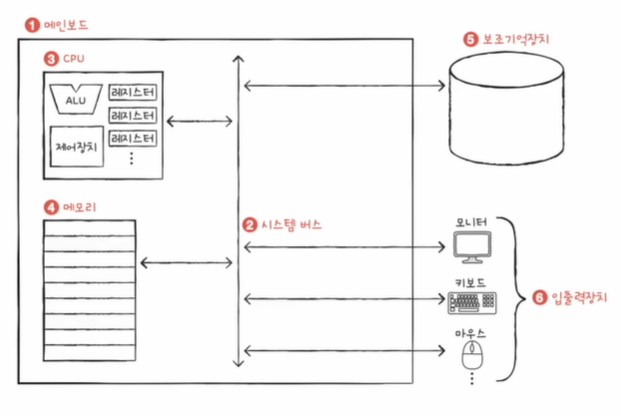

 

#### ✅컴퓨터의 네 가지 핵심 부품1 : 메모리
- **현재 실행되는 프로그램**의 명령어와 데이터를 저장하는 부품
- 프로그램이 실행되기 위해서는 메모리에 저장되어 있어야 한다.
- 메모리에는 '주소'라는 개념이 있다.
    - 내가 원하는 명령어와 데이터의 위치를 알 수 있다.

 

#### ✅컴퓨터의 네 가지 핵심 부품2 : CPU
- 메모리에 저장된 명령어를 읽어 들이고, 해석하고, 실행하는 부품 -> 컴퓨터의 **두뇌**
- 내부 구성 부품
    - ALU(산술논리연산장치) : 계산기 - 계산을 위한 회로들의 모임
    - 레지스터 : CPU 내부의 작은 저장장치
    - 제어장치 : 제어 신호를 내보내고, 명령어를 해석하는 장치

    > **제어신호?**  
    > 컴퓨터 부품들을 관리하고 작동시키기 위한 전기 신호  
    > 메모리 읽기, 메모리 쓰기(저장)

 

#### ✅컴퓨터의 네 가지 핵심 부품3 : 보조기억장치
> - 필요한 이유  
    - RAM은 보조기억장치에 비해 비싸다.  
    - RAM은 전원이 꺼지면 저장된 내용을 잃는다.

- 전원이 꺼져도 보관될 프로그램을 저장하는 부품
    - 메모리는 **실행할 정보**를 저장하고, 보조기억장치는 **보관할 정보**를 저장한다.
- 메모리를 보조하는 **특별한 입출력장치**

 

#### ✅컴퓨터의 네 가지 핵심 부품4 : 입출력장치
- 컴퓨터 외부에 연결되어 컴퓨터 내부와 정보를 교환할 수 있는 부품

 

#### ✅메인보드
- 메인보드에 연결된 부품은 버스를 통해 정보를 주고 받는다.
- 버스는 컴퓨터의 부품끼리 정보를 주고받는 일종의 통로
- 다양한 종류의 버스가 있다.
- **시스템 버스** : 핵심 부품을 연결하는 버스

 

#### ✅시스템 버스의 내부 구성
- 주소 버스 : 주소를 주고받는 통로
- 데이터 버스 : 명령어와 데이터를 주고받는 통로
- 제어 버스 : 제어 신호를 주고받는 통로

> **메모리 값 읽어 들이기**
> 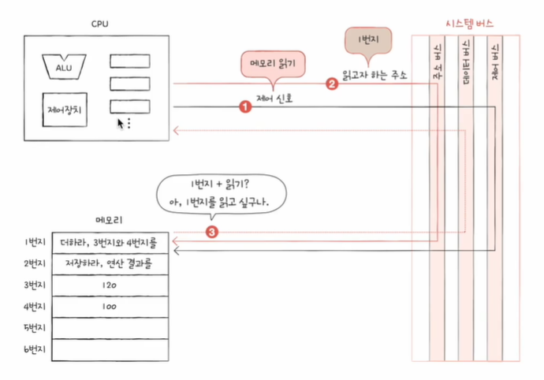

> **메모리 값 쓰기**
> 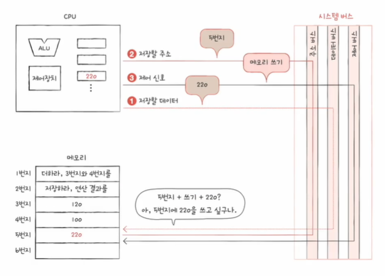

 

## 🔢0과 1로 숫자를 표현하는 방법
#### ✅정보단위
- 비트(bit) : 0과 1을 표현하는 가장 작은 정보 단위
   - 프로그램은 수많은 비트로 이루어져 있음
   - 바이트, 킬로바이트, 메가바이트, 기가바이트, 테라바이트, ...
   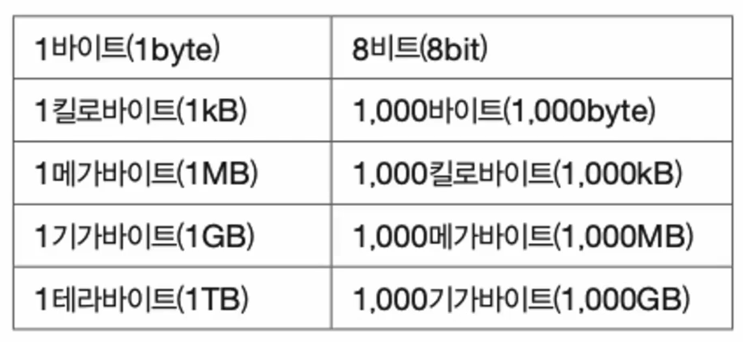
   - 이전 단위를 1024개씩 묶은 단위는 kiB, MiB, GiB, ...
- 워드(word) : CPU가 한 번에 처리할 수 있는 정보의 크기 단위
   - 하프 워드 : 워드의 절반 크기
   - 풀 워드 : 워드 크기
   - 더블 워드 : 워드의 두 배 크기

 

#### ✅이진법(binary)
- 0과 1로 수를 표현하는 방법
- 숫자가 1을 넘어가는 시점에 자리올림
- 일상적으로 사용하는 진법은 십진법(decimal) 
   > 이진수 8 표기
   > - 1000(2)
   > - 0b1000
- 0과 1로 음수 표현하기 : 2의 보수
   - 어떤 수를 그보다 큰 2n에서 뺀 값
   - 모든 0과 1을 뒤집고 1 더한 값!
   > **"-1011(2)를 표현하기 위한 0101(2)과 십진수 5를 표현하기 위한 0101(2)은 똑같이 생겼는데, 어떻게 구분하죠?"**  
   > CPU 내부에 플래그(flag) 레지스터가 있다.

 

#### ✅십육진법
- 이진법으로는 숫자의 길이가 너무 길어진다
   - 십진수 32 == 이진수 100000
- 그래서 컴퓨터의 데이터를 표현할 때 십육진법도 많이 사용
   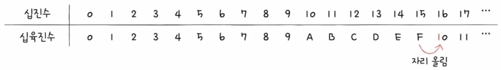
   > 십육진수 15 표기
   > - 15(16) : 수학적 표기 방식
   > - 0x15 : 코드상 표기 방식
- 직접 코드에 써넣는 사례도 많다.

 

#### ✅TIP
이진수 <-> 십육진수 변환이 쉽기 때문에 사용한다.
> 이진수 -> 십육진수 변환
   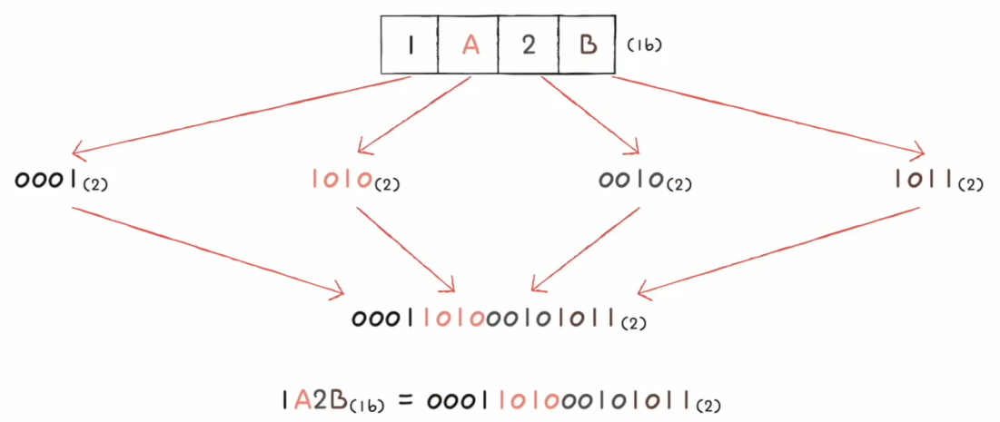

 

> 십육진수 -> 이진수 변환
   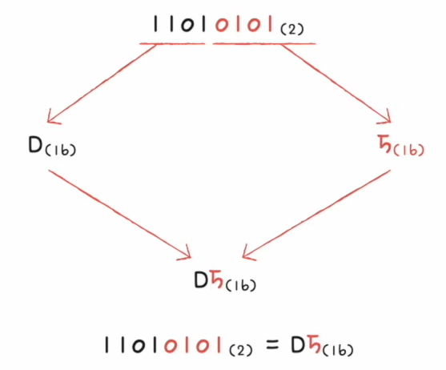

 

## 🆎0과 1로 문자를 표현하는 방법
#### ✅문자 집합과 인코딩
- 문자 집합(character set)
   - 컴퓨터가 이해할 수 있는 문자의 모음
- 인코딩(encoding)
   - 코드화하는 과정
   - 문자를 0과 1로 이루어진 문자 코드로 변환하는 과정
      > ex) Hello -> 0100100
- 디코딩(decoding)
   - 코드를 해석하는 과정
   - 0과 1로 표현된 문자 코드를 문자로 변환하는 과정
      > ex) 0100100 -> Hello

 

#### ✅아스키 코드
- 알파벳, 아라비아 숫자, 일부 특수 문자 및 제어 문자를 표현한 문자 집합
- 7비트로 하나의 문자 표현
   - 8비트 중 1비트는 오류 검출을 위해 사용되는 **패리티 비트**
   - 2의 7승개 표현 가능 -> 총 128개(0~127)
- 간단한 인코딩. but 한글을 포함한 다른 언어 문자, 다양한 특수 문자 표현 불가

 

#### ✅한글 인코딩 : 완성형 vs 조합형 인코딩
- 한글을 위한 인코딩이 필요
   - 한글의 특징(영어는 알파벳을 이어 쓰면 단어가 됨)
      - 초성, 중성, 종성의 조합으로 이루어진 한글
   - **완성형 인코딩 방식**과 **조합형 인코딩 방식**이 존재
      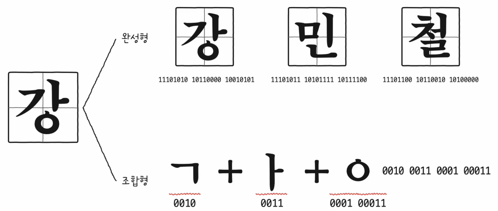

 

#### ✅완성형 인코딩 : EUC-KR
- KS X 1001 KS X 1003 문자집합 기반의 한글 인코딩 방식
- 글자 하나 하나에 2바이트 크기의 코드 부여
   - 2바이트 == 16비트 == 4자리 십육진수로 표현
      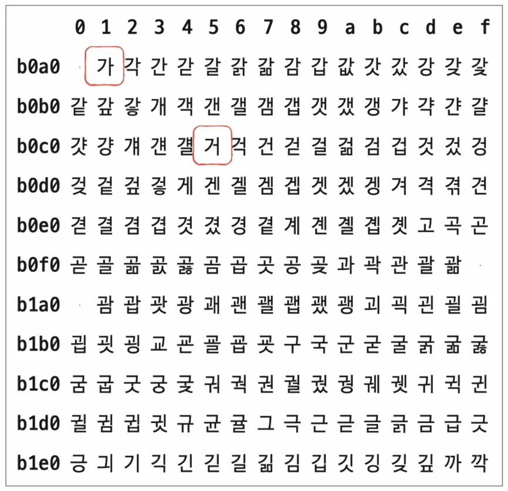
- 2300여개 한글 표현 가능, 여전히 부족한 수
- 인코딩을 국가마다 하게 되면 언어별 인코딩을 모두 이해해야 한다.
   - 통일 되면 어떨까?해서 나온 게 **유니코드 문자 집합**과 **UTF-8**
> 직접 인코딩 해보기 - https://dencode.com/

 

#### ✅유니코드
- 통일된 문자 집합
- 한글, 영어, 화살표와 같은 특수 문자, 심지어 이모티콘까지 가능
- 현대 문자 표현에 있어 매우 중요한 위치
- 유니코드 인코딩 방식 : utf-8, utf-16, utf-32, ...
> 유티코드 문자 집합 - https://symbl.cc/en/unicode/blocks/

 

#### ✅UTF-8
- 가변 길이 인코딩 : 인코딩 결과가 1바이트~4바이트
   - 길이는 유니코드 범위에 따라 결정된다.
> 직접 인코딩해보기 - https://onlineutf8tools.com/convert-utf8-to-binary

 

#### ✅TIP
- 글자가 깨져요? -> 인코딩을 의심!

 

## 📇소스 코드와 명령어
#### ✅고급 언어와 저급 언어
- 고급 언어 : 개발자가 이해하기 쉽게 만든 언어(C, C++, Java, ...)
- 저급 언어 : 컴퓨터가 이해하고 실행하는 언어(= 명령어)

 

#### ✅저급언어
- 기계어 : 0과 1로 이루어진 명령어로 구성된 저급 언어
   - 기계어를 어셈블리어로 변환
- 어셈블리어 : 기계어를 읽기 편한 형태로 번역한 저급 언어

 

#### ✅고급언어
- 저급언어로 변환하는 방법
   - 컴파일 언어
   - 인터프리트 언어
- **컴파일 언어**
   - 소스 코드(고급언어) -> 컴파일러(컴파일) -> 목적 코드(저급언어)
   - 소스 코드 전체를 한 번에 컴파일 한다.
      - 컴파일 중 오류가 발생하면 전체가 실행되지 않는다.
- **인터프리트 언어**
   - 인터프리터에 의해 한 줄씩 실행
   - 소스 코드 전체가 저급언어로 변환되기까지 기다릴 필요가 없다.
      - 인터프리트 중 오류가 발생하면 오류 발생 전까지의 코드는 실행된다.
> 컴파일&인터프리트 과정 살펴보기 - https://godbolt.org/

 

## ⌨️명령어의 구조
#### ✅명령어의 구조
- 무엇을 **대상(데이터 혹은 데이터 위치)**으로, 무엇을 **수행**하라
   - ex) "멍멍아, 이거 물어와!"
- **명령어는 연산 코드와 오퍼랜드로 구성**된다.
   - 연산 코드 : 수행할 연산
   - 오퍼랜드 : 데이터 혹은 데이터 위치
- 기계어, 어셈블리어도 명령어다.

 

#### ✅오퍼랜드
- 연산에 사용될 데이터 or 연산에 사용될 데이터가 저장된 위치(= **주소필드**)
- 오퍼랜드는 없을 수 있고 1개 이상일 수도 있다.

 

#### ✅연산코드
- 수행할 연산(CPU마다 다름)
   - 데이터 전송
      - MOVE : 데이터를 옮겨라
      - STORE : 메모리에 저장하라
      - LOAD(FETCH) : 메모리에서 CPU로 데이터를 가져와라
      - PUSH : 스택에 데이터를 저장하라
      - POP : 스택의 최상단 데이터를 가져와라
      > **스택?**  
      > 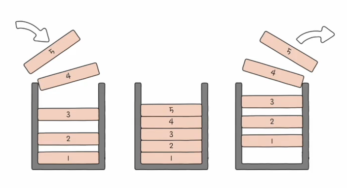
      > LIFO(last in first out)

      > **큐?**  
      > 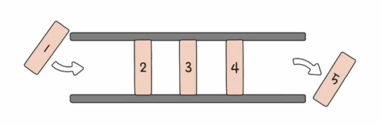
      > FIFO(first in first out)
   - 산술/논리 연산
      - ADD / SUBTRACT / MULTIPLY / DIVIDE : 사칙연산
      - INCREMENT / DECREMENT : 오퍼랜드에 1을 더하라, 1을 빼라
      - AND / OR / NOT:AND / NOT : 연산을 수행하라
      - COMPARE : 두개의 숫자 또는 TRUE / FALSE 값을 비교하라
   - 제어 흐름 변경
      - JUMP : 특정 주소로 실행 순서를 옮겨라
      - CONDITIONAL JUMP : 조건에 부합할 때 특정 주소로 실행 순서를 옮겨라
      - HALT : 프로그램의 실행을 멈춰라
      - CALL : 되돌아올 주소를 저장한채 특정 주소로 실행 순서를 옮겨라
      - RETURN : CALL을 호출할 때 저장했던 주소로 돌아가라
   - 입출력 제어
      - READ(INPUT)
      - WRITE(OUTPUT)
      - START IO
      - TEST IO

 

#### ✅명령어 주소 지정 방식
- 유효주소(effective address)
   - 연산에 사용할 데이터가 저장된 위치
- 명령어 주소 지정 방식(addressing modes)
   - 연산에 사용할 데이터가 저장된 위치를 찾는 방법 == 유효주소를 찾는 방법
   - 다양한 명령어 주소 지정 방식이 있다.

#### ✅명령어 주소 지정 방식1 : 즉시 주소 지정 방식
- immediate addressing mode
- 연산에 사용할 데이터를 오퍼랜드 필드에 직접 명시
- 가장 간단한 형태의 주소 지정 형식
- 연산에 사용할 데이터의 크기가 작아질 수 있지만 빠르다.
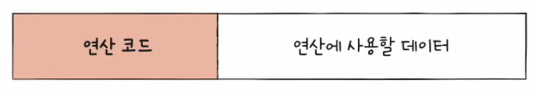

 

#### ✅명령어 주소 지정 방식2 : 직접 주소 지정 방식
- direct addressing mode
- 오퍼랜드 필드에 유효 주소 직접적으로 명시
- 유효 주소를 표현할 수 있는 크기가 연산 코드만큼 줄어든다.
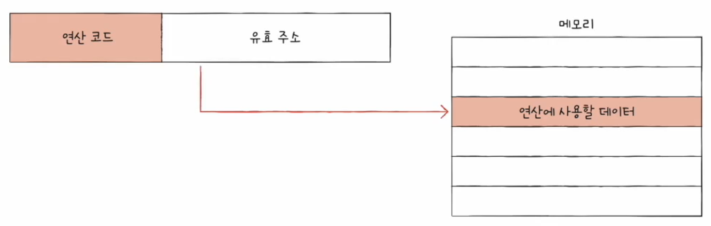

 

#### ✅명령어 주소 지정 방식3 : 간접 주소 지정 방식
- inderect addressing mode
- 오퍼랜드 필드에 유효 주소의 주소를 명시
- 앞선 주소 지정 방식들에 비해 속도가 느리다.
    - 메모리 접근을 최소화 하는 것이 무조건 속도 면에서 좋다.
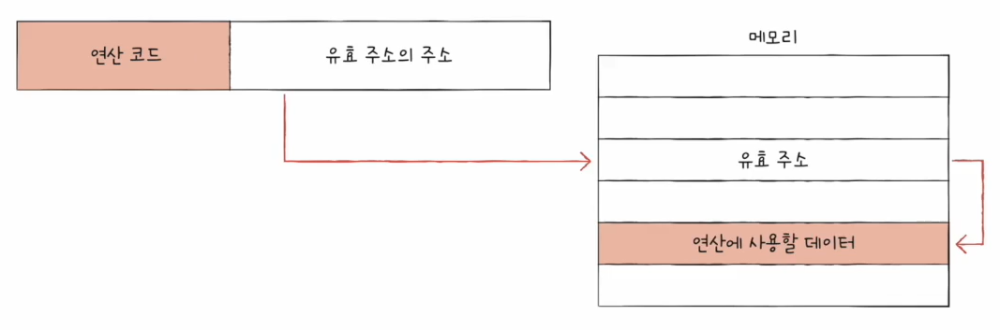

 

#### ✅명령어 주소 지정 방식4 : 레지스터 주소 지정 방식
- register addressing mode
- 연산에 사용할 데이터가 저장된 레지스터 명시
- **메모리(CPU 밖)에 접근하는 속도보다 레지스터(CPU 안)에 접근하는 것이 빠르다.**
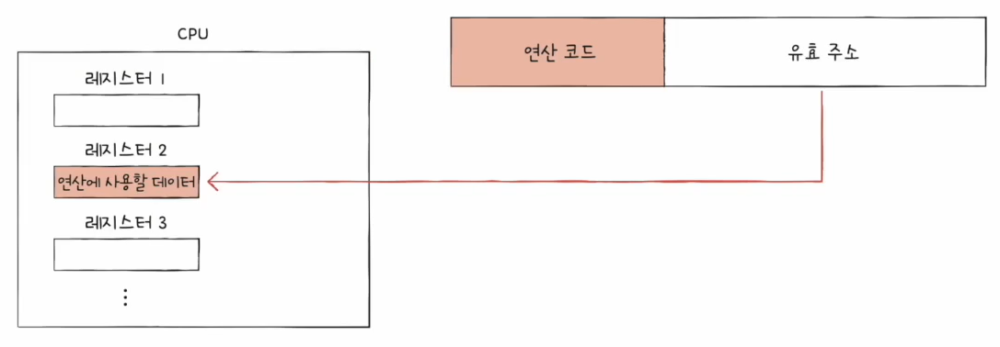

 

#### ✅명령어 주소 지정 방식5: 레지스터 간접 주소 방식
- register indirect addressing mode
- 연산에 사용할 데이터를 메모리에 저장
- 그 주소를 저장한 레지스터를 오퍼랜드 필드에 명시
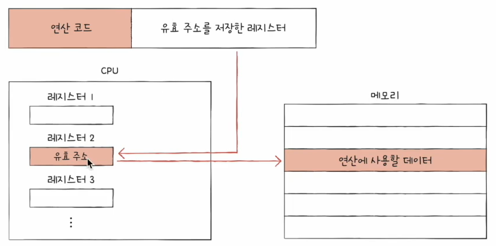

 

## 💡소스 코드가 명령어가 되기까지
#### ✅C언어의 컴파일 과정
- 전처리기 -> 컴파일러 -> 어셈블러 -> 링커
- 전처리
   - 본격적으로 컴파일 하기 전에 처리할 작업들
   - 외부에 선언된 다양한 소스 코드, 라이브러리 포함
   - 프로그래밍의 편의를 위해 작성된 매크로 변환
   - 컴파일할 영역 명시
- 컴파일
   - 전처리가 완료 되어도 여전히 소스 코드
   - 전처리 완료된 소스 코드를 저급 언어(어셈블리 언어)로 변환
- 어셈블
   - 어셈블리어를 기계어로 변환
   - 목적 코드를 포함하는 목적 파일이 된다.
   > **목적파일 vs 실행파일**  
   > - 목적 파일과 실행 파일은 둘 다 기계어로 이루어진 파일
   > - But, 목적 파일은 링킹(linking)을 거친 이후에야 실행 파일이 된다.