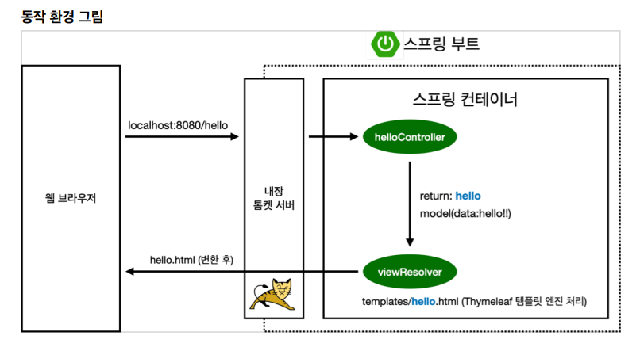
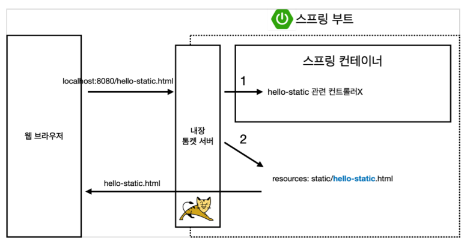
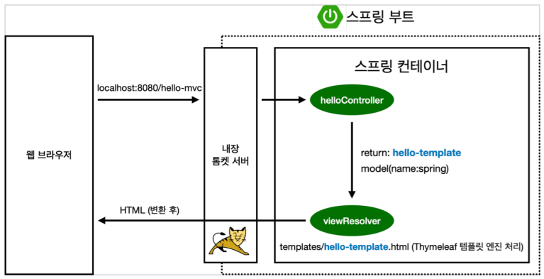
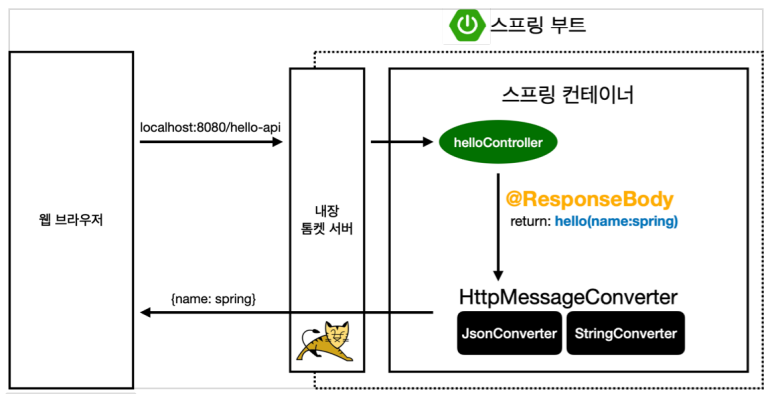

# 스프링 입문 - 김영한님 강의

### [목차]
1. [프로젝트 환경설정](#프로젝트-환경설정)

2. [스프링 웹 개발 기초](#스프링-웹-개발-기초)

3. [회원 관리 예제 - 백엔드 개발](#회원-관리-예제---백엔드-개발)

3. [스프링 빈과 의존관계](#스프링-빈과-의존관계)

4. [회원 관리 예제 - 웹 MVC 개발](#회원-관리-예제---웹-mvc-개발)

5. [스프링 DB 접근 기술](#스프링-db-접근-기술)

6. [AOP](#aop)

<br>


## 프로젝트 환경설정

### ✅ 프로젝트 생성

**스프링 부트 스타터 사이트로 이동해서 스프링 프로젝트 생성**
https://start.spring.io

- 프로젝트 선택
  - Project : Gradle - Groovy Project
  - Spring Boot : 2.3.x
  - Language : Java
  - Packaging : Jar
  - Java : 11
- Project Metadata
  - groupId : hello
  - artifactId : hello-spring
- Dependencies : Spring Web, Thymeleaf

<br>

> 주의! - 스프링 부트 3.0
> - java 17 이상
> - javax 패키지 이름 -> jakarta로 변경
> - H2 데이터베이스 2.1.214 버전 이상

<br>

### ✅ 라이브러리 살펴보기

> Gradle은 의존관계가 있는 라이브러리를 함께 다운로드

<br>

**스프링 부트 라이브러리**
- spring-boot-starter-web
  - spring-boot-starter-tomcat : 톰캣 (웹서버)
  - spring-webmvc : 스프링 웹 MVC
- spring-boot-starter-thymeleaf : 타임리프 템플릿 엔진(View)
- spring-boot-starter(공통) : 스프링 부트 + 스프링 코어 + 로깅
  - spring-boot
    - spring-core
  - spring-boot-starter-logging
    - logback, slf4j

<br>

**테스트 라이브러리**
- spring-boot-starter-test
  - junit : 테스트 프레임워크
  - mockito : 목 라이브러리
  - assertj : 테스트 코드를 좀 더 편하게 작성하게 도와주는 라이브러리
  - spring-test : 스프링 통합 테스트 지원

<br>

### ✅ View 환경설정

**Welcome Page 만들기**
- 스프링 부트가 제공하는 Welcome Page 기능
  - ```static/index.html```을 올려두면 Welcome page 기능 제공
- 동작 환경

  - 컨트롤러에서 리턴 값으로 문자를 반환하면 뷰 리졸버(```viewResolver```)가 화면을 찾아 처리
    - 스프링 부트 템플릿 기본 viewName 매핑
    - ```resources:templates/``` + {viewName} + ```.html```

<br>

> ```spring-boot-devtools``` 라이브러리를 추가하면, ```html```파일을 컴퍼일만 해주면 서버 재시작 없이 View 파일 변경이 가능
> - 인텔리J 컴파일 방법 : 메뉴 build -> Recompile

<br>

### ✅ 빌드하고 실행하기

**콘솔로 이동**
1. ```./gradlew build```
2. ```cd build/libs```
3. ```java -jar hello-spring-0.0.1-SNAPSHOT.jar```
4. 실행 확인

<br>

**윈도우 사용자를 위한 팁**
- 콘솔로 이동 명령 프롬프트(cmd)로 이동
- ```./gradlew``` -> ```gradlew.bat```를 실행하면 됩니다.
- 명령 프롬프트에서 ```gradlew.bat```를 실행하려면 ```gradlew```하고 엔터를 치면 됩니다.
- ```gradlew build```
- 폴더 목록 확인 ```ls``` -> ```dir```
- 윈도우에서 Git bash 터미널 사용하기
  - 링크: https://www.inflearn.com/questions/53961

<br>

## 스프링 웹 개발 기초

### ✅ 정적 컨텐츠

스프링 부트 정적 컨텐츠 기능



<br>

### ✅ MVC와 템플릿 엔진

MVC : Model, View, Controller



<br>

### ✅ API

- ```@ResponseBody```를 사용하면 뷰 리졸버(```viewResolver```)를 사용하지 않음
- 대신 HTTP의 BODY에 문자 내용을 직접 반환
- ```@ResponseBody```를 사용하고, 객체를 반환하면 객체가 JSON으로 변환



- ```@ResponseBody``` 를 사용
  - HTTP의 BODY에 문자 내용을 직접 반환
  - ```viewResolver``` 대신에 ```HttpMessageConverter```가 동작
  - 기본 문자처리 : ```StringHttpMessageConverter```
  - 기본 객체처리 : ```MappingJackson2HttpMessageConverter```
  - byte 처리 등등 기타 여러 ```HttpMessageConverter```가 기본으로 등록되어 있음

<br>

## 회원 관리 예제 - 백엔드 개발

## 스프링 빈과 의존관계

## 회원 관리 예제 - 웹 MVC 개발

## 스프링 DB 접근 기술

## AOP